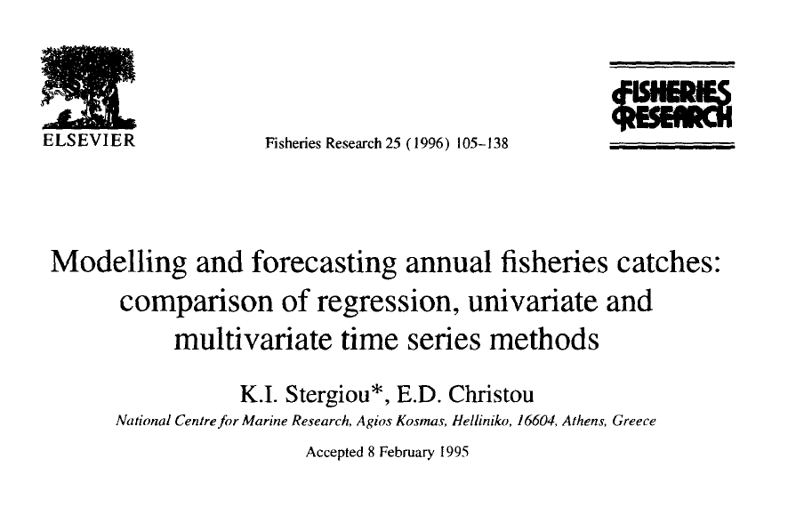

---
output:
  xaringan::moon_reader:
    css: "my-theme.css"
    lib_dir: libs
    nature:
      highlightStyle: github
      highlightLines: true
---

layout: true

.hheader[<a href="index.html">`r fontawesome::fa("home", fill = "steelblue")`</a>]

---

```{r setup, include=FALSE, message=FALSE, purl=FALSE}
options(htmltools.dir.version = FALSE, servr.daemon = TRUE)
library(huxtable)
```

```{r load-packages, include=FALSE, message=FALSE}
require(ggplot2)
```


class: center, middle, inverse
# Forecasting Time Series
## Eli Holmes
.large[_Northwest Fisheries Science Center<br>National Oceanic and Atmospheric Administration<br>Seattle, WA_]

.futnote[eli.holmes@noaa.gov]

.citation[http://eeholmes.github.io]

---

## Forecasting Time Series

This week we will learn a number of standard approaches for forecasting from time series alone--meaning without any covariates or exogenous variables.  At the end of the week, we will address how to incorporate covariates into a time series forecast.

---

## Many approaches are available for non-seasonal modeling

.pull-left.left[
*Stergiou and Christou 1996*

- Time-varying regression
- Box-Jenkins models, aka ARIMA models
- Multivariate time-series approaches
    - Harmonic regression
    - Dynamic regression
    - Vector autoregression (MAR)
- Exponential smoothing (2 variants)
- Exponential surplus yield model (FOX)
]

.pull-right.left[
*Georgakarakos et al. 2006*

- Box-Jenkins models, aka ARIMA models
- Artificial neural networks (ANNs)
- Bayesian dynamic models

*Lawer 2016*

- Box-Jenkins models, aka ARIMA models
- Artificial neural networks (ANNs)
- Exponential Smoothing (6 variants)
]

---

## Forecasting Time Series

We will focus on three of these methods.  We will start with time-varying regression as it is simple to apply and understand.  The rest of the week we will learn about ARIMA models which have a long tradition and Exponential smoothing models, which are newer and often best performing.

- Time-varying regression
- Box-Jenkins models, aka ARIMA models
- Exponential Smoothing

---

## Stergiou and Christou 1996

I will demonstrate these methods by replicating the work in Stergiou and Christou (1996) Modelling and forecasting annual fisheries catches: comparison of regression, univariate and multivariate time series methods. Fisheries Research 25: 105-136.




---

## Data

We will use the annual landings data from Hellenic (Greek) waters that were used in Stergiou and Christou (1996). 

Stergiou and Christou analyzed 16 species.  We will look two of the species: Anchovy and Sardine.  

Stergiou and Christou used the data from 1964-1989.  We have the data up to 2007, but will focus mainly on 1964-1989 (the first half of the time series) to replicate Stergiou and Christou's analyses.

---


---


---


---

Load the data as follows and use only the 1964-1989 data.
```{r load_data, fig.align = "center", fig.height = 4, fig.width = 8}
data(greeklandings, package="FishForecast")
landings = subset(greeklandings, Year <= 1989 & Species %in% c("Anchovy","Sardine"))
ggplot(landings, aes(x=Year, y=log.metric.tons)) +
  geom_line() + facet_wrap(~Species)
```

---

Stergiou and Christou (1996) used 1964-1987 to fit (train) their models and held out 1988-1989 for testing forecasts.  We will follow this and will use 1964-1987 when fitting the models.

