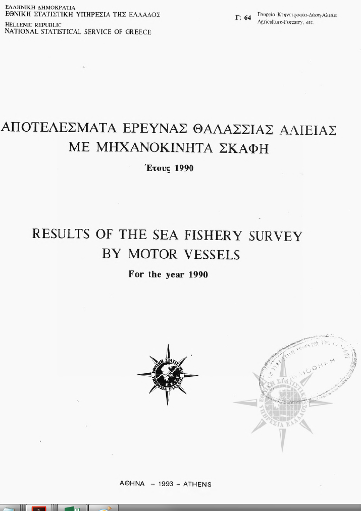
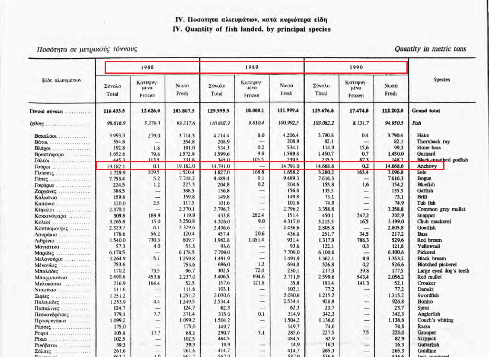

---
output:
  xaringan::moon_reader:
    css: "my-theme.css"
    lib_dir: libs
    nature:
      highlightStyle: github
      highlightLines: true
---

```{r setup, include=FALSE, message=FALSE}
options(htmltools.dir.version = FALSE, servr.daemon = TRUE)
library(huxtable)
```

class: center, middle, inverse
# Forecasting Time Series
## Eli Holmes
.large[_Northwest Fisheries Science Center<br>National Oceanic and Atmospheric Administration<br>Seattle, WA_]

.futnote[eli.holmes@noaa.gov]

.citation[@eli_holmes]

---

## Forecasting Time Series

This week we will learn a number of standard approaches for forecasting from time series alone (meaning without any covariates or exogenous variables).  In later, weeks we will address how to incorporate covariates into a time series model and forecast.

---

## Many approaches are available for non-seasonal modeling

.pull-left.left[
*Stergiou and Christou 1995*

- Time-varying regression
- Box-Jenkins models, aka ARIMA models
- Multivariate time-series approaches
    - Harmonic regression
    - Dynamic regression
    - Vector autoregression (MAR)
- Exponential smoothing (2 variants)
- Exponential surplus yield model (FOX)
]

.pull-right.left[
*Georgakarakos et al. 2006*

- Box-Jenkins models, aka ARIMA models
- Artificial neural networks (ANNs)
- Bayesian dynamic models

*Lawer 2016*

- Box-Jenkins models, aka ARIMA models
- Artificial neural networks (ANNs)
- Exponential Smoothing (6 variants)
]

---

## Forecasting Time Series

We will focus on a subset of these methods.  There are methods have a very long tradition (ARIMA), are often found to be the best or equally best method (Exponential smoothing), are non-parametric and recently used in a number of fisheries papers (EDM), and are commonly used in many variants (DLM):

- Time-varying regression
- Box-Jenkins models, aka ARIMA models
- Exponential Smoothing
- Empirical dynamic modeling (EDM)
- Dynamic linear modeling (DLM)

---

## Stergiou and Christou 1996

I will demonstrate these methods by replicating the work in Stergiou and Christou (1996) Modelling and forecasting annual fisheries catches: comparison of regression, univariate and multivariate time series methods. Fisheries Research 25: 105-136.

.center[

!(./figs/StergiouChristou1996.jpeg)

]


---

## Data

We will use the annual landings data from Hellenic (Greek) waters that were used in Stergiou and Christou (1996). Stergiou and Christou analyzed 16 species.  We will look a subset of species: Anchovy, Sardine, Chub mackerel, Horse mackerel, and Jack mackerel.  Stergiou and Christou used the data from 1964-1989.  We have the data up to 2007, but will focus mainly on 1964-1989 (the first half of the time series) to replicate Stergiou and Christou's analyses.

---


---



---



---

Load the data as follows and use only the 1964-1989 data.
```{r load_data, fig.align = "center", fig.height = 4, fig.width = 8}
load("Data/landings.RData")
landings$log.metric.tons = log(landings$metric.tons)
landings = subset(landings, Year <= 1989)
landings = subset(landings, Species %in% c("Anchovy","Sardine"))
library(ggplot2)
ggplot(landings, aes(x=Year, y=log.metric.tons)) +
  geom_line() + facet_wrap(~Species)
```


