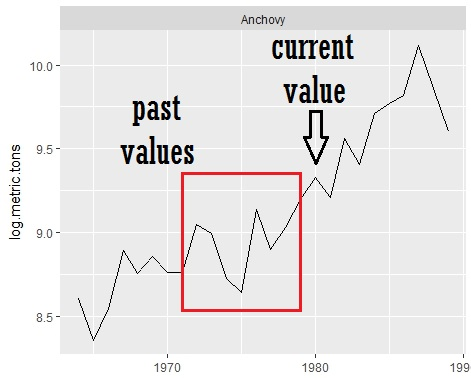

---
output:
  xaringan::moon_reader:
    css: "my-theme.css"
    lib_dir: libs
    nature:
      highlightStyle: github
      highlightLines: true
---

layout: true

.hheader[<a href="index.html">`r fontawesome::fa("home", fill = "steelblue")`</a>]

---

```{r setup, include=FALSE, message=FALSE}
options(htmltools.dir.version = FALSE, servr.daemon = TRUE)
knitr::opts_chunk$set(fig.height=5)
library(huxtable)
```

class: center, middle, inverse
# Forecasting Time Series
## ARIMA Models

.futnote[Eli Holmes, NOAA Fisheries]

.citation[eli.holmes@noaa.gov]

---

```{r load_data, echo=FALSE, message=FALSE, warning=FALSE}
load("landings.RData")
landings$log.metric.tons = log(landings$metric.tons)
landings = subset(landings, Year <= 1989)
anchovy = subset(landings, Species=="Anchovy")$log.metric.tons
sardine = subset(landings, Species=="Sardine")$log.metric.tons

library(ggplot2)
library(gridExtra)
library(reshape2)
library(tseries)
library(urca)
```

## Basic idea

Past values in the time series have information about the current state.  An ARMA model models the current state as a linear function of past values:

$$x_t = \phi_1 x_{t-1} + \phi_2 x_{t-2} + ... + \phi_p x_{t-p} + e_t$$

.center[



]

---

## ARIMA models (Box-Jenkins models)

You will commonly see ARIMA models referred to as *Box-Jenkins* models.  This model has 3 components (p, d, q):

- **AR autoregressive**  $y_t$ depends on past values. The AR level is maximum lag $p$.

$$x_t = \phi_1 x_{t-1} + \phi_2 x_{t-2} + ... + \phi_p x_{t-p} + e_t$$

- **I differencing** $x_t$ may be a difference of the observed time series.  The number of differences is denoted $d$. First difference is $d=1$:

$$x_t = y_t - y_{t-1}$$

- **MA moving average**  The error $e_t$ can be a sum of a time series of independent random errors.  The maximum lag is denoted $q$.

$$e_t = \eta_t + \theta_1 \eta_{t-1} + \theta_2 \eta_{t-2} + ... + \theta_q \eta_{t-q},\quad \eta_t \sim N(0, \sigma)$$

---

## Create some data from an AR(2) Model

$$x_t = 0.5 x_{t-1} + 0.3 x_{t-2} + e_t$$

```{r arima.sim, fig.align="center"}
dat = arima.sim(n=1000, model=list(ar=c(.5,.3)))
plot(dat)
abline(h=0, col="red")
```

---

```{r arimavsrn, fig.align="center", echo=FALSE}
par(mfrow=c(1,2))
plot(dat[1:500],type="l",ylab="dat")
abline(h=0, col="red")
title("ar(2)")
plot(rnorm(length(dat))[1:500],type="l",ylab="dat",xlab="Time")
abline(h=0, col="red")
title("random normal")
```

---

## AR(2) is auto-correlated

Plot the data at time $t$ against the data at time $t-1$

```{r arimavsrncorr, fig.align="center", echo=FALSE}
par(mfrow=c(1,2))
TT=length(dat)
plot(dat[2:TT],dat[1:(TT-1)],type="p")
title("ar(2)")
rn=rnorm(length(dat))
plot(rn[2:TT],rn[1:(TT-1)],type="p")
title("random normal")
```

---

## Auto-correlation function

The auto-correlation function is the correlation between the data at time $t$ and $t+1$.  This is one of the basic diagnostic plots for time series data.

```{r acf, fig.align="center"}
acf(dat[1:50])
```

---

`cor()` is the correlation function.

```{r corr}
cor(dat[2:TT], dat[1:(TT-1)])
cor(dat[11:TT], dat[1:(TT-10)])
```

```{r acf2, fig.align="center", echo=FALSE}
par(mfrow=c(1,2))
plot(dat[1:50], type="b", pch="x")
title("dat[1:50]")
acf(dat,lag.max=25)
```

---

## ACF for independent data

```{r acf.random, fig.align="center",echo=FALSE}
rn <- rnorm(TT)
par(mfrow=c(1,2))
plot(rn[1:50], type="b", pch="x")
title("random 1:50")
acf(rn,lag.max=25)
```

---

## Partial ACF

$$x_t = 0.5 x_{t-1} + 0.3 x_{t-2} + e_t$$

```{r pacf.ar2, fig.align="center"}
pacf(dat)
```

---

## Partial ACF for AR(1)

$$x_t = 0.5 x_{t-1} + e_t$$

```{r pacf.ar3, fig.align="center"}
dat <- arima.sim(TT, model=list(ar=c(.5)))
pacf(dat)
```
---

## Box-Jenkins Method

This refers to a step-by-step process of selecting a forecasting model.  You need to go through the steps otherwise you could end up fitting a nonsensical model or using fitting a sensible model with an algorithm that will not work on your data.

A. Model form selection
  1. Evaluate stationarity and seasonality
  2. Selection of the differencing level (d)
  3. Selection of the AR level (p)
  4. Selection of the MA level (q)
B. Parameter estimation
C. Model checking

---

.pull-left.left[
## Lectures

1. Stationarity
2. Model Selection
3. Fitting Models (parameter estimation)
4. Forecasting
5. Model Checking
]

.pull-right.left[
## Labs

1. Create and plot data from ARMA processes
2. Test the Greek catch data for stationarity
3. Fit ARMA models to the Greek catch data
4. Create forecasts
5. Test forecast performance
]