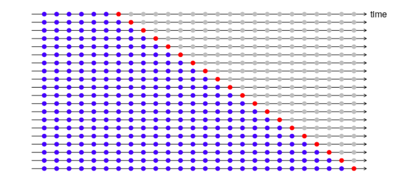
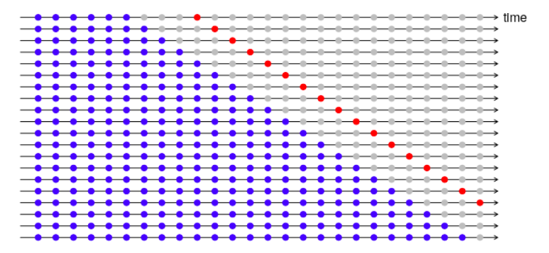

---
output:
  xaringan::moon_reader:
    css: "my-theme.css"
    lib_dir: libs
    nature:
      highlightStyle: github
      highlightLines: true
---

layout: true

.hheader[<a href="index.html">`r fontawesome::fa("home", fill = "steelblue")`</a>]

---

```{r setup, include=FALSE, message=FALSE}
options(htmltools.dir.version = FALSE, servr.daemon = TRUE)
knitr::opts_chunk$set(fig.height=5, fig.align="center")
library(huxtable)
```

class: center, middle, inverse
# ARIMA Models
## Cross Validation

.futnote[Eli Holmes, NOAA Fisheries]

.citation[eli.holmes@noaa.gov]

---

```{r load_packages, echo=FALSE, message=FALSE, warning=FALSE}
library(ggplot2)
library(gridExtra)
library(reshape2)
library(tseries)
library(forecast)
```

```{r load_data2, message=FALSE, warning=FALSE, echo=FALSE}
load("landings.RData")
landings$log.metric.tons = log(landings$metric.tons)
```

## Measures of forecast fit

To measure the forecast fit, we fit a model to training data and test a forecast against data in a test set.  We 'held out' the test data and did not use it at all in our fitting.

```{r echo=FALSE}
spp <- "Anchovy"
training = subset(landings, Year <= 1987)
test = subset(landings, Year >= 1988 & Year <= 1989)

traindat <- subset(training, Species==spp)$log.metric.tons
testdat <- subset(test, Species==spp)$log.metric.tons
plot(1964:1987, traindat, xlim=c(1964,1989))
points(1988:1989, testdat, pch=2, col="red")
legend("topleft", c("Training data","Test data"), pch=c(1,2), col=c("black", "red"))
```

---

We will fit to the training data and make a forecast.

```{r}
fit1 <- auto.arima(traindat)
fr <- forecast(fit1, h=2)
fr
```

```{r echo=FALSE}
plot(fr)
points(25:26, testdat, pch=2, col="red")
legend("topleft", c("forecast","actual"), pch=c(20,2), col=c("blue","red"))
```

---

How to we quantify the difference between the forecast and the actual values?

```{r}
fr.err <- testdat - fr$mean
fr.err
```

There are many metrics.  The `accuracy()` function in forecast provides many different metrics: mean error, root mean square error, mean absolute error, mean percentage error, mean absolute percentage error.

---

### ME Mean err

```{r}
me <- mean(fr.err)
me
```

### RMSE Root mean squared error

```{r}
rmse <- sqrt(mean(fr.err^2))
rmse
```

### MAE Mean absolute error

```{r}
mae <- mean(abs(fr.err))
mae
```

---

### MPE Mean percentage error

```{r}
fr.pe <- 100*fr.err/testdat
mpe <- mean(fr.pe)
mpe
```

### MAPE Mean absolute percentage error

```{r}
fr.pe <- 100*fr.err/testdat
mape <- mean(abs(fr.pe))
mape
```

---

```{r}
accuracy(fr, testdat)[,1:5]
```

```{r}
c(me, rmse, mae, mpe, mape)
```

---

## Test all the models in your candidate model

```{r}
fit1 <- Arima(traindat, order=c(0,1,1))
fr1 <- forecast(fit1, h=2)
test1 <- accuracy(fr1, testdat)[2,1:5]

fit2 <- Arima(traindat, order=c(1,1,0))
fr2 <- forecast(fit2, h=2)
test2 <- accuracy(fr2, testdat)[2,1:5]

fit3 <- rwf(traindat, drift=TRUE)
fr3 <- forecast(fit3, h=2)
test3 <- accuracy(fr3, testdat)[2,1:5]
```

---

## Show a summary

```{r results='asis', echo=FALSE}
sum.tests <- rbind(test1, test2, test3)
knitr::kable(sum.tests, format="html")
```

## Cross-Validation


---

## Time-series cross-validation with forecast

```{r}
far2 <- function(x, h, order){
  forecast(Arima(x, order=order), h=h)
  }
e <- tsCV(traindat, far2, h=1, order=c(0,1,1))
#RMSE
tsrmse1 <- sqrt(mean(e^2, na.rm=TRUE))
tsrmse1
```

Compare to RMSE from just the 2 test data points.
```{r}
test1
```

---

## Cross-validation farther in future



---

Compare accuracy of forecasts 1 year out versus 4 years out

```{r}
e <- tsCV(traindat, far2, h=4, order=c(0,1,1))
#RMSE
tsrmse4 <- sqrt(mean(e^2, na.rm=TRUE))
c(tsrmse1, tsrmse4)
```
